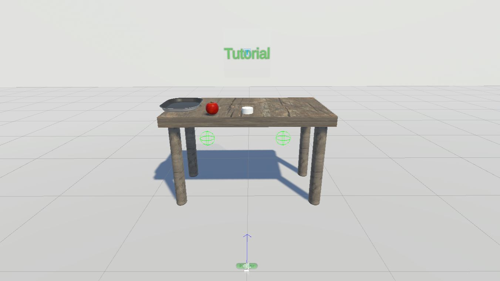

# VR-Tutorial
**A tutorial scene where the player can understand the basics of VR interaction, moving, picking objects, teleporting.**
This tutorial is originally designed for HTC Vive.

## Description 
An empty room, with only a table and simple objects. The player hears a voice introducing the VR and inviting to move the head and look around.

Afterwards the voice explains how to grab the objects and release them, showing the relative button on the controller. 

The tutorial is self-paced, so will proceed only when the player will pick the apple and release it onto the tray.

Finally, the voice will instruct the player how to teleport, showing the relative button and enabling this function. 

Once the player teleported, at the end of the tutorial, it is possible to set automatically the passage to another scene. 
It also can be done on the keyboard using designated keys to go to next scene or start/finish the tutorial. 

[[All my VR Projects here]](https://github.com/igor-lirussi?tab=repositories&q=virtual-reality)

### Topics:
- VR Virtual-Reality 
- Tutorial
- Template Project

## Result

## Requirements & Dependencies
- Unity 2021.2
- SteamVR Plugin

## Install 
- clone the repository
- open with UnityHub

## Run
Execute the project with Unity

## Troubleshooting
if the SteamVR Plugin is not recognized:
- Download it from the Asset Store, Add it to the project and import it.
- Window -> SteamVR Input -> Save and Generate
- Add player to scene from SteamVR examples

## Useful Resources & Extra
- [Quickstart SteamVR](https://valvesoftware.github.io/steamvr_unity_plugin/articles/Quickstart.html)



## Authors
* **Igor Lirussi** @ BOUN Boğaziçi University - BuViar Lab

## Acknowledgments
*   All the people that contributed with suggestions and tips.

## License
This project is licensed - see the [LICENSE](LICENSE) file for details.
